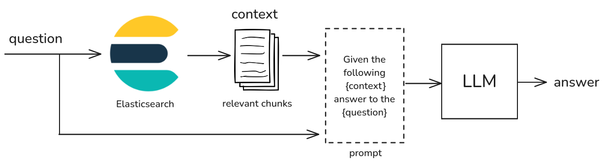

# A simple RAG architecture using LangChain + Ollama + Elasticsearch

This is a simple implementation of a classic Retrieval-augmented generation (RAG)
architecture in Python using [LangChain](https://www.langchain.com/), [Ollama](https://ollama.com)
and [Elasticsearch](https://github.com/elastic/elasticsearch).

## Install Ollama

If you want to run the examples locally you need to install [Ollama](https://ollama.com/download).

We tested [Llama 3.2](https://www.llama.com/) at 3B as local LLM. 
You can download this LLM as follows:

```bash
ollama pull llama3.2:3b
```

You can try using Llama 3.2 in the console running the following command:

```bash
ollama run llama3.2:3b
```

Now, you can chat with the model. To exit from the chat write `/bye`.

## Install Elasticsearch

To install Elasticsearch execute the following shell command in the root folder
of the project:

```bash
curl -fsSL https://elastic.co/start-local | sh
```

Elasticsearch will be installed in the `elastic-start-local` folder.
The Elasticsearch service will run on `localhost:9200`. You will have also [Kibana](https://www.elastic.co/kibana)
running at `http://localhost:5601`. You can enter in the web management console using the
`elastic` user and the password provided during the installation.

If you want to have a quick introduction to Elasticsearch, you can read the following
[basics](https://www.elastic.co/guide/en/elasticsearch/reference/current/elasticsearch-intro.html).

## Install the Python examples

To run the Python examples you need to install all the dependecies.
Before, we suggest to activate the virtual environment for Python, using the
following command:

```bash
python -m venv .venv
```
And then activate the virtual environment with the command:

```bash
source .venv/bin/activate
```

After, you can install the dependencies as follows:

```bash
pip install -r requirements.txt
```

If you don't have **pip** installed you can install it following this [guide](https://pip.pypa.io/en/stable/installation/).

## Who won the Nobel Prize in Physics 2024?

If you try to ask the question "Who won the Nobel Prize in Physics 2024?" to Llama 3.2
the answer will be something like this:

```
I don't have information on the winner of the Nobel Prize in Physics for 2024, as it has not been announced yet...
```

This response make sense since Llama 3.2 has been trained on documents since 31 December 2023.
The model does not know the answer.

We can build a simple Retrieval-Augmented Generation (RAG) architecture using LangChain and Elasticsearch to
extend the knowledge of Llama 3.2. 

## RAG architecture

The RAG architecture uses a vector database to store chunk of documents (the new knowledge).
When we ask a *question* to a RAG system, the question is used to search in the vector
database using **semantic search**. The database retrieves the most relevant chunks in an
ordered list. We can than, choose the top-n chunks (*context*) and assemble a prompt as
follows:

```
Given the following {context} answer to the following question {question}.
If you cannot anwer given the provided context just say "I don't know the answer".
```

This prompt is finally sent to the LLM to give an aswer (see Figure).



## Run the LangChain RAG example

The first step is to store some documents in Elasticsearch to improve the knowledge of Llama 3.2.
We prepared a PDF file in [data/press-physics-node-prize-2024.pdf](data/press-physics-nobel-prize-2024.pdf)
that containes the press release of the Nobel Prize 2024 announcement.

You can use the [src/store_data.py](src/store_data.py) program to store the document in Elasticsearch
using the following steps:
- Read the PDF file
- Extract the text and split the content in chunks
- Store the chunks in Elasticsearch, using the Llama 3.2 embedding

You can execute the script from the command line:

```bash
python src/store_data.py
```

When we have the chunks stored in Elaticsearch, we can use the RAG architecture to expand the
knowledge of Llama 3.2 to provide an aswer to the question: *Who won the Nobel Prize in Physics 2024?*.

THe RAG architecture is implemented using [LangChain](https://github.com/langchain-ai/langchain)
and [LangGraph](https://langchain-ai.github.io/langgraph) libraries.

You can execute the rag script as follows:

```bash
python src/rag.py
```

The output should be something like this:

```
Who won the Nobel Prize in Physics 2024?
The Nobel Prize in Physics 2024 was awarded to John J. Hopfield and Geoffrey Hinton
for their foundational discoveries and inventions that enable machine learning
with artificial neural networks...
```

Using the RAG architecture we extended the knowledge of Llama 3.2 that now is able
to answer to the question.

## Copyright

Copyright (C) 2025 by [Enrico Zimuel](https://www.zimuel.it/).